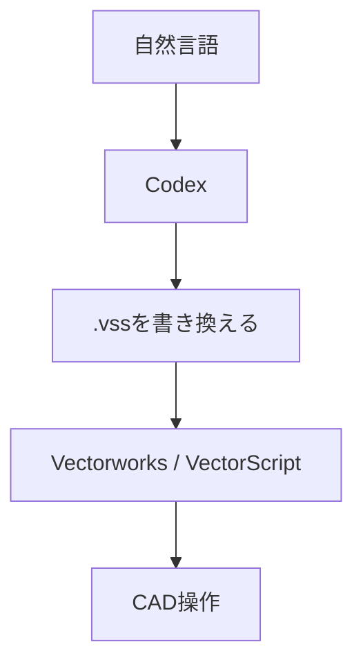

今、仕事で使っている VectorScript を VS Code の開発環境に移して、GitHub で管理するようにしているのですが、その過程でこの方法を思いつきました。

### 設定

1. Vectorworks で プラグインマネージャからメニュープラグイン `vs_AI` を作る。
   ※プラグインの名前は何でもいいです。
2. スクリプトの内部を、下記のように記述する。
   `{$INCLUDE c:\Users\<username>\vectorscript\vs_AI.vss}`
   ※パスは Codex がアクセスできる場所なら何でもいいです。
3. Vectorworks の環境設定で、「スクリプトを開発者モードで実行」にチェックを入れておく。
4. 「ツール ＞ 作業画面 ＞ 作業画面の編集」から、先ほど作成した `vs_AI` を適当なメニューに登録する。
5. 下記の空ファイルを作成する。
    `c:\Users\<username>\vectorscript\vs_AI.vss`
6. Codex で下記のフォルダアクセスを設定する。
   `C:\Users\<username>\vectorscript`

### 使い方

1. Codex に「やってもらいたいこと」を伝える。
2. しばらくすると、Codex が`vs_AI.vss`にその処理を行うための VectorScript を書き込む。
3. Vectorworks のメニューから `vs_AI` 実行する。

### 仕組み



### ChatGPT に調べてもらった他のCADとの比較表
2026年9月時点で ChatGPT に調べてもらったところ、概ね下表のような違いがあるようです。。

| 比較項目          | AutoCAD 2027 | Archicad 29 | Vectorworks + Codex + VectorScript |
| ------------- | ------------ | ----------- | ---------------------------------- |
| CAD内AIチャット    | ○            | ○           | ×                                  |
| 自然言語で質問       | ○            | ○           | ○ Codex側                           |
| 自然言語でオブジェクト選択 | ○            | ○           | **作れば可能**                          |
| モデル情報問い合わせ    | ○            | ○           | **作れば可能**                          |
| 図形をAI生成       | △ Web版ブロック   | △           | **○ VectorScriptを書かせる**            |
| 任意のCAD処理を追加   | 現状限定的        | 現状限定的       | **かなり自由**                          |
| AIが処理自体をプログラム | 基本×          | 基本×         | **○ Codex**                        |
| 自作機能を継続的に改良   | 限定的          | 限定的         | **○**                              |

しかし、意外に「やってもらいたいこと」って無いんですよね。

便利なプロンプトを思いつきましたら、ここに追記していきたいと思います。

### サンプル
#### プロンプト1

できるかな？

```Codexプロンプト
300×300mm の四角形を長さ 5100mm に隙間約100mmでx方向に割り付けて
```

#### 結果1 ≫ 成功と言えると思います。

![[300_square_layout.png]]

#### プロンプト2-1
自作プラグインのパラメータの変更です。私自身、どうやったら実現できるのか分かりません。
```Codexプロンプト
「ha_図名・図番」というプラグインオブジェクトに日付というパラメータがあります。  
カレント図面の日付 "2025.02.21"を"2026-09-09"に変更してください。
```


#### 結果2-1
初回、失敗でした。図番・図名も勝手に変更される図面がありました。

#### プロンプト2-1
もう一度プロンプトを考えてみました。
```Codex
実行したところ、日付は指示通りになりましたが、図名や図番まで変わってしまった箇所がありました。図名や図番を変えずに日付のみ変更するようにしたいです。カレント図面は破棄し再読み込みしました。再度お願いします。
```


#### 結果2-2
今度は成功しました。このファイルは意匠図で、配置図から建具表まで入っているのですが、全て意図通りになりました。

```image-grid-captions
columns: 2
gap: 16
![[date_correction-01.png|実行前]]
![[date_correction-02.png|実行前]]
```

自作プラグインのパラメータ操作までできるのは、正直スゴイです。

```image-grid-captions
columns: 2
gap: 16
![[date_correction-03.png|実行後]]
![[date_correction-04.png|実行後]]
```


#### プロンプト3-1
排水溝幅の変更をお願いしました。選択図形をpxファイルに書き出すスクリプトは後述します。


```Codex
この図形は、排水溝です。幅は250mmです。350mmに変更したいです。  
pxファイルの変更ではなく、カレント図面に描画するようにお願いします。
```

#### プロンプト3-2
初回は、外形を変えず、350mmになりました。寸法をふるのを忘れましたが、正しい溝幅になりました。しかし多角形が閉じていません。

```Codex
大体OKですが、下記訂正をお願いします。  
1. 多角形だと思うのですが、一ヶ所閉じていない場所があります。  
2. 外枠を守るのではなく、250mmの中心線から、175mmずつ振り分けて350mmになるようにお願いします。
```

#### 結果3
2回目のプロンプト今度は成功しました。寸法をふるのを忘れましたが、中心振り分けの正しい溝幅になりました。

```image-grid-captions
columns: 2
gap: 15
![[change_width-01.png|プロンプト3-1の結果3-1]]
![[Change_width-02.png|プロンプト3-2の結果3-2]]
```

#### 選択図形をpxファイルにするスクリプト
下記スクリプトを登録して実行できるようにすると、選択図形の情報を Codex に渡すことが出来ます。
```Pascal
(*******************************************************************************

                    選択図形をVectorScriptの描画関数に変換する 0.3

  

                    Copyright 2025 兵藤善紀建築設計事務所

                    www.hyodo-arch.com

  

    ■■■ 簡単マニュアル ■■■

        １．追加したい変数を入力 ≫ 'SH/2' など文字列を入れておきたい場合など

        ２．ファイルを書き出す場所のチェック

        ３．基準点を原点として計算される。

  

    2026.09.09  Ver 0.3     四角形の型番号を修正。出力先をカレントファイルと同じフォルダに変更。

                        既存ファイルを上書きせず、sts-001.px の形式で連番保存する。

    2025.02.27  Ver 0.2     四角形と隅の丸い四角形を追加

    2025.01.09  Ver 0.1     開発開始（ha_Test-02）

 *******************************************************************************)

PROCEDURE ShapesToScript ;

LABEL 999;

  

CONST

    varX = ''       ;   {追加したい変数がある場合}

    varY = ''       ;   {追加したい変数がある場合}

  

VAR

    stsFilePath, stsFileName        

                                :STRING;    {出力先フォルダ、出力ファイルのパス}

    kk, nn , NSO, fileErr       :INTEGER;   {カウンタ、選択図形の数、ファイルエラー}

    hhLayer,hhSel               :HANDLE;    {レイヤハンドル、選択図形操作対象ハンドル}

    SelObj        :DYNARRAY[] OF HANDLE;    {選択図形ひとつひとつに割り当てるハンドル}

  

    OrgnPos, AbsPos, RelPos,                {原点、絶対座標、相対座標}

    Abs2Pos, Abs3Pos            :POINT;     {絶対座標2, 3}

    sScript                     :STRING;    {出力するコード、コードに追加したい変数座標}

    xD, yD,                                 {隅の丸い四角形の角丸め寸法}

    Radius, strAng, arcAng      :REAL;      {円半径、円開始角度、円弧角}

  
  

{****************** ファイルの存在を調べる ******************}

    FUNCTION StsFileExists(fileName : STRING) : BOOLEAN;

    VAR

        errCode : INTEGER;

    BEGIN

        UseDefaultFileErrorHandling(FALSE);

        Open(fileName);

        errCode := GetLastFileErr;

        IF errCode = 0 THEN Close(fileName);

        StsFileExists := (errCode = 0) OR (errCode = 5) OR (errCode = 10);

    END; {StsFileExists}

  
  

{****************** カレントファイルの保存先フォルダを取得 ******************}

    FUNCTION GetCurrentDocumentFolder(VAR folderName : STRING) : BOOLEAN;

    VAR

        fullPath, pathChar : STRING;

        pathPos : INTEGER;

        foundPath : BOOLEAN;

    BEGIN

        fullPath := GetFPathName;

        pathPos := Len(fullPath);

        foundPath := FALSE;

        folderName := '';

  

        WHILE (pathPos > 0) & (NOT foundPath) DO BEGIN

            pathChar := Copy(fullPath, pathPos, 1);

            IF (pathChar = '\') OR (pathChar = '/') OR (pathChar = ':') THEN BEGIN

                folderName := Copy(fullPath, 1, pathPos);

                foundPath := TRUE;

            END

            ELSE pathPos := pathPos - 1;

        END;

  

        GetCurrentDocumentFolder := foundPath;

    END; {GetCurrentDocumentFolder}

  
  

{****************** 上書きしない出力ファイル名を作る ******************}

    FUNCTION GetNextOutputFileName(folderName : STRING) : STRING;

    VAR

        candidateName, countText : STRING;

        fileNum : INTEGER;

    BEGIN

        candidateName := Concat(folderName, 'sts.px');

        fileNum := 1;

  

        WHILE StsFileExists(candidateName) DO BEGIN

            countText := Num2Str(0, fileNum);

            WHILE Len(countText) < 3 DO countText := Concat('0', countText);

            candidateName := Concat(folderName, 'sts-', countText, '.px');

            fileNum := fileNum + 1;

        END;

  

        GetNextOutputFileName := candidateName;

    END; {GetNextOutputFileName}

  

BEGIN

{出力先ファイル}

    IF NOT GetCurrentDocumentFolder(stsFilePath) THEN BEGIN

        AlrtDialog('カレントファイルが保存されていません。ファイルを保存してから再実行してください。');

        GOTO 999;

    END;

    stsFileName := GetNextOutputFileName(stsFilePath);

  

{選択図形}

    {選択図形の数を調べる}

    NSO:=NumSelectedObjects;

    IF NSO = 0 THEN BEGIN

        AlrtDialog('図形が選択されていません。');

        GOTO 999;

    END;

  

    {選択図形各々にハンドルを割り当てる}

    If NSO>0 Then Allocate SelObj[1..NSO];

    nn:=1;

    hhLayer:=FLayer;

    While hhLayer<>nil Do Begin

        hhSel:=FInLayer(hhLayer);

        While hhSel<>nil Do Begin

            If Selected(hhSel) Then Begin

                SelObj[nn]:=hhSel;

                nn:=nn+1;

            End;

            hhSel:=NextObj(hhSel);

        End;

        hhLayer:=NextLayer(hhLayer);

    End;

    DSelectAll;

  

{テキストを出力}

    {ファイルを開く}

    UseDefaultFileErrorHandling(FALSE);

    ReWrite (stsFileName);  {リライトする}

    fileErr := GetLastFileErr;

    IF fileErr <> 0 THEN BEGIN

        AlrtDialog(Concat('ファイルを作成できませんでした。', Chr(13), stsFileName, Chr(13), 'エラーコード: ', fileErr));

        GOTO 999;

    END;

  

    {Lucus を探す}

    OrgnPos.x := 0;

    OrgnPos.y := 0;

    For nn:=1 To NSO Do Begin

        If GetTypeN(SelObj[nn])=17 Then GetLocPt(SelObj[nn], OrgnPos.x, OrgnPos.y);

    End;

    {選択図形の描画スクリプトを書く}

    For nn:=1 To NSO Do Begin

        If GetTypeN(SelObj[nn])=2 Then Begin    {直線の場合}

            GetSegPt1(SelObj[nn], AbsPos.x, AbsPos.y);

            RelPos := AbsPos-OrgnPos;

            sScript := Concat('MoveTo(', RelPos.x, varX, ',', RelPos.y, varY, ');');

            WriteLnMac(sScript);

            GetSegPt2(SelObj[nn], AbsPos.x, AbsPos.y);

            RelPos := AbsPos-OrgnPos;

            sScript := Concat('LineTo(', RelPos.x, varX, ',', RelPos.y, varY, ');');

            WriteLnMac(sScript);

        End;

        If GetTypeN(SelObj[nn])=3 Then Begin    {四角形の場合}

            HCenter (SelObj[nn], AbsPos.x, AbsPos.y);

            RelPos := AbsPos-OrgnPos;

            sScript := Concat(

                'RectangleN(',

                RelPos.x - HWidth(SelObj[nn])/2,',',

                RelPos.y - HHeight(SelObj[nn])/2,',',

                '1,0,',

                HWidth(SelObj[nn]),',',

                HHeight(SelObj[nn]),');'

                );

                {左下が原点、direction は x方向に1とした}

            WriteLnMac(sScript);

        End;

        If GetTypeN(SelObj[nn])=13 Then Begin   {隅の丸い四角形の場合}

            HCenter (SelObj[nn], AbsPos.x, AbsPos.y);

            RelPos := AbsPos-OrgnPos;

            GetRRDiam ( SelObj[nn], xD, yD );

            sScript := Concat(

                'RRectangleN(',

                RelPos.x - HWidth(SelObj[nn])/2,',',

                RelPos.y - HHeight(SelObj[nn])/2,',',

                '1,0,',

                HWidth(SelObj[nn]),',',

                HHeight(SelObj[nn]),',',

                xD,',',

                yD,');'

                );

                {左下が原点、direction は x方向に1とした}

            WriteLnMac(sScript);

        End;

        If GetTypeN(SelObj[nn])=6 Then Begin    {円、円弧の場合（長円・楕円は別）}

            HCenter (SelObj[nn], AbsPos.x, AbsPos.y);       {円の中心座標を取得}

            Get2DPt (SelObj[nn], 2, Abs2Pos.x, Abs2Pos.y);  {円の頂点を取得、index=1は円弧の中心、2は円弧端}

            GetArc  (SelObj[nn], strAng, arcAng);       {円弧の開始角度と角度を取得}

            Radius:=Distance(AbsPos.x, AbsPos.y, Abs2Pos.x, Abs2Pos.y);{半径を取得}

            RelPos := AbsPos-OrgnPos;

            sScript := Concat(

                'ArcByCenter(',

                RelPos.x,',',

                RelPos.y,',',

                Radius,',',

                strAng,',',

                arcAng,');'

                );

            WriteLnMac(sScript);

        End;

        If GetTypeN(SelObj[nn])=5 Then Begin    {多角形の場合}

            sScript := 'Poly(';

            For kk:=1 To GetVertNum(SelObj[nn]) Do begin

                GetPolyPt(SelObj[nn], kk, AbsPos.x, AbsPos.y);

                RelPos := AbsPos-OrgnPos;

                sScript := Concat(sScript, RelPos.x, varX, ',', RelPos.y, varY, ',');

            end;

            Delete(sScript, Len(sScript), 1);

            sScript := Concat(sScript,');');

            WriteLnMac(sScript);

        End;

        {/////// 円弧、曲線、角の丸い四角形などは、状況に応じて追加する //////}

    End;

  

{ファイルを閉じる}

    Close (stsFileName);

  

999:

END;

Run( ShapesToScript );
```