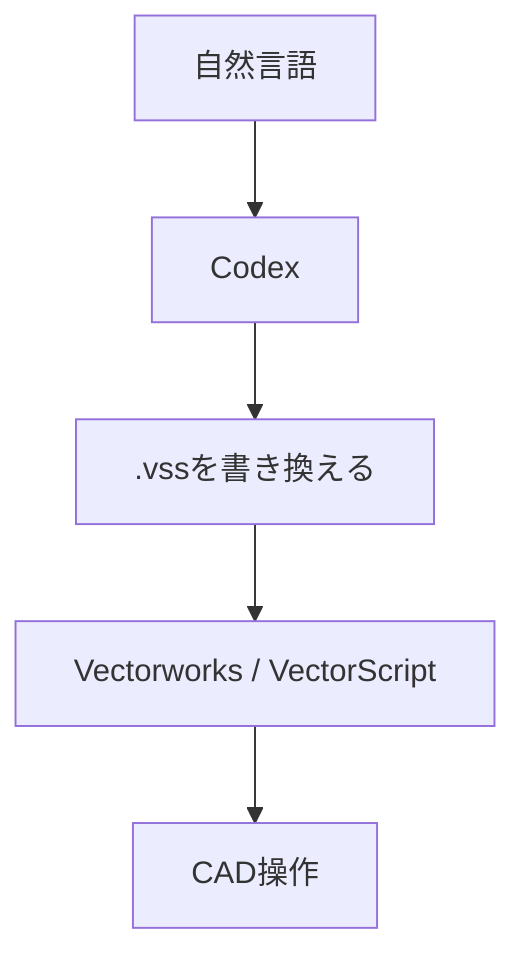

今、仕事で使っている VectorScript を VS Code の開発環境に移して、GitHub で管理するようにしているのですが、その過程でこの方法を思いつきました。

### 設定

1. Vectorworks で プラグインマネージャからメニュープラグイン `vs_AI` を作る。
   ※プラグインの名前は何でもいいです。
2. スクリプトの内部を、下記のように記述する。
   `{$INCLUDE c:\Users\<username>\vectorscript\vs_AI.vss}`
   ※パスは Codex がアクセスできる場所なら何でもいいです。
3. Vectorworks の環境設定で、「スクリプトを開発者モードで実行」にチェックを入れておく。
4. 「ツール ＞ 作業画面 ＞ 作業画面の編集」から、先ほど作成した `vs_AI` を適当なメニューに登録する。
5. 下記の空ファイルを作成する。
    `c:\Users\<username>\vectorscript\vs_AI.vss`
6. Codex で下記のフォルダアクセスを設定する。
   `C:\Users\<username>\vectorscript`

### 使い方

1. Codex に「やってもらいたいこと」を伝える。
2. しばらくすると、Codex が`vs_AI.vss`にその処理を行うための VectorScript を書き込む。
3. Vectorworks のメニューから `vs_AI` 実行する。

### 仕組み



### ChatGPT に調べてもらった他のCADとの比較表
2026年9月時点で ChatGPT に調べてもらったところ、概ね下表のような違いがあるようです。。

| 比較項目          | AutoCAD 2027 | Archicad 29 | Vectorworks + Codex + VectorScript |
| ------------- | ------------ | ----------- | ---------------------------------- |
| CAD内AIチャット    | ○            | ○           | ×                                  |
| 自然言語で質問       | ○            | ○           | ○ Codex側                           |
| 自然言語でオブジェクト選択 | ○            | ○           | **作れば可能**                          |
| モデル情報問い合わせ    | ○            | ○           | **作れば可能**                          |
| 図形をAI生成       | △ Web版ブロック   | △           | **○ VectorScriptを書かせる**            |
| 任意のCAD処理を追加   | 現状限定的        | 現状限定的       | **かなり自由**                          |
| AIが処理自体をプログラム | 基本×          | 基本×         | **○ Codex**                        |
| 自作機能を継続的に改良   | 限定的          | 限定的         | **○**                              |

しかし、意外に「やってもらいたいこと」って無いんですよね。

便利なプロンプトを思いつきましたら、ここに追記していきたいと思います。

### サンプル
#### プロンプト1
できるかな？
```Codexプロンプト
300×300mm の四角形を長さ 5100mm に隙間約100mmでx方向に割り付けて
```

#### 結果1 ≫ 成功と言えると思います。
![[300_square_layout.png]]

#### プロンプト2-1
自作プラグインのパラメータの変更です。私自身、どうやったら実現できるのか分かりません。
```Codexプロンプト
「ha_図名・図番」というプラグインオブジェクトに日付というパラメータがあります。  
カレント図面の日付 "2025.02.21"を"2026-09-09"に変更してください。
```

#### 結果2-1
初回、失敗でした。図番・図名も勝手に変更される図面がありました。
もう一度プロンプトを考えてみました。
```Codex
実行したところ、日付は指示通りになりましたが、図名や図番まで変わってしまった箇所がありました。図名や図番を変えずに日付のみ変更するようにしたいです。カレント図面は破棄し再読み込みしました。再度お願いします。
```

#### 結果2-2
今度は成功しました。このファイルは意匠図で、配置図から建具表まで入っているのですが、全て意図通りになりました。
```image-grid-captions
columns: 2
gap: 16
![[date_correction-01.png|実行前]]
![[date_correction-02.png|実行前]]
```

```image-grid-captions
columns: 2
gap: 16
![[date_correction-03.png|実行後]]
![[date_correction-04.png|実行後]]
```