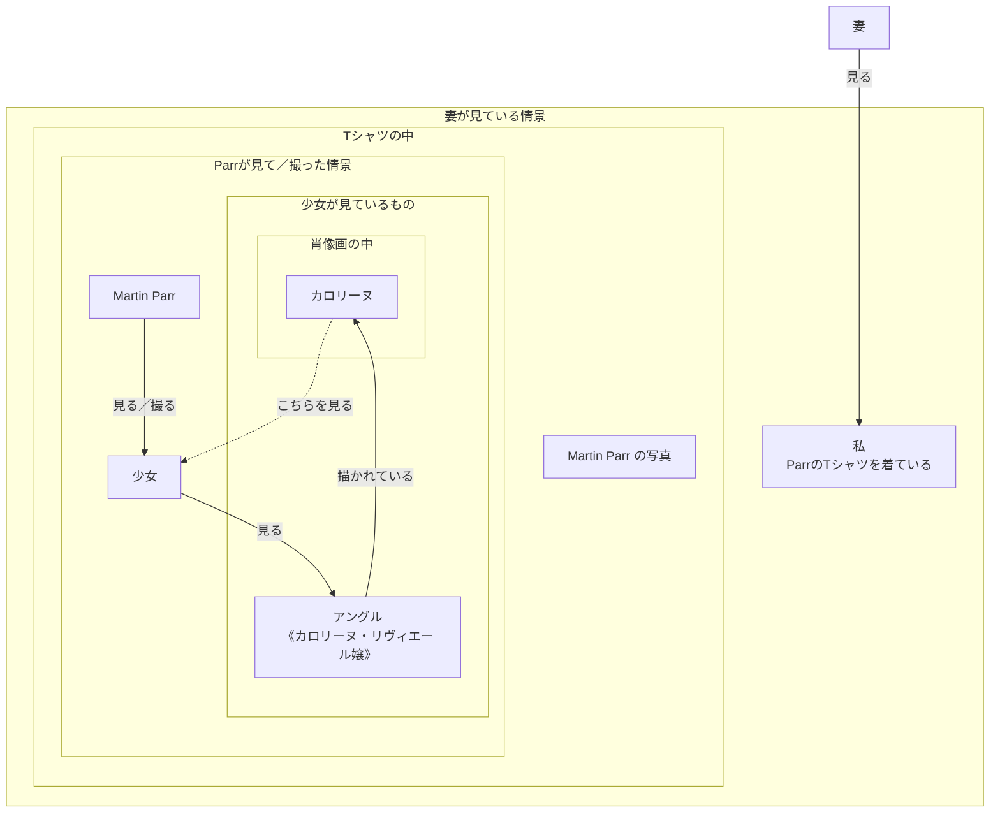

## 今朝、Martin Parr のユニクロTシャツを着た

今朝の朝食、妻との会話。

> 妻：そのTシャツの中の絵は何？
> 私：そういえば何だろ？たぶんアングル。こないだ図書館の画集で観た。

![[g20260813_231012420_iOS.jpg]]
このTシャツは、ユニクロの「Art for All」プロジェクトの一環で商品化されたもので、ショップにコーナーがあり、買ったことがある人も結構いると思う。我が家では、妻は佐藤可士和デザイン、息子はモネの睡蓮、[エマニュエル・ムホー](https://www.emmanuelle.jp/)（学校の近くにムホーの建築作品がある）デザイン、私はParrの他に[ジュリアン・オピー](https://en.wikipedia.org/wiki/Julian_Opie)などを持っている。

今年5月、私は近所のユニクロショップで「Martin Parr がユニクロTシャツになってる、何でだろ？とりあえず買っとこ！」という軽いノリで購入し、時々着ていた。[Martin Parr](https://en.wikipedia.org/wiki/Martin_Parr) はマグナム・フォト所属の写真家で、観光、余暇、消費などの場にいる人々の振る舞いを、ユーモアをもって独特の観察眼で撮り続けてきた。このTシャツの作品のように、美術館で作品を見る、あるいは撮影する人々も、Parrにとって格好の被写体だった。

激レアで超高価な写真集のコレクターでもあり、それら稀少な写真集が納められている扉の壊れた書架は機会があるならば是非観てみたいと思っていた。ポストカードの蒐集家で、無聊写記の[[Profile|プロフィール]]でも取り上げている『Boring Postcards』は、Parrが蒐集したあまりに退屈な風景を被写体にした（謎の）ポストカード集であり、私は年に何回かはページを開いてめくるお気に入りの写真集？である。変わったことに興味をもっていて諧謔味のある写真家である。

さて、上の写真が件のParrデザインのTシャツで、よく見るといくつか文字が書かれている。 "≫" 以下の日本語は、私の勝手な意訳である。

- MARTIN PARR  MUSÉE DU LOUVRE ≫ ルーヴル美術館で美術作品を鑑賞する人々を撮影したParrの作品
- MADEMOISELLE CAROLINE RIVIÈRE, ≫ カロリーヌ・リヴィエール嬢[^1]の肖像
- JEAN-AUGUSTE-DOMINIQUE INGRES, ≫ ジャン＝オーギュスト＝ドミニク・アングルは、フランスの画家
- 1805, ROOM 702 ≫ 1805年の作品、702室[^2]で展示

で、調べてみたところ、実際ほぼ上記の通りであった。

## もう少しよく見てみる

Martin Parr の作品を知るものならば、このTシャツの写真は、美術館で作品を見る人々を撮った作品と似ていることに気が付くだろう。つまり、下記の構造である。

- アングルはカロリーヌ嬢を見て描いている。
- 描かれたカロリーヌ嬢はこちら側を見ている。
- 少女はアングルの見ていたカロリーヌ嬢の肖像作品を見ている。
  （作品の中のカロリーヌ嬢は少女を見ている。）

画家、モデル、鑑賞者の視点が次々と移り変わる

このシリーズが興味深いのは、さらに掘り下げることができることである。

- Parrは、少女が、アングルが見て描いたカロリーヌ嬢の肖像画を見ている情景を、見ている。
- 「このＴシャツを買った私」は、Parrが、アングルが見たカロリーヌ嬢の肖像画を見ている少女が見ている情景を見た写真を見ている。
- 「私が着たこのＴシャツの写真を見た妻」は・・・・・・、

とにかく「見る人を見る」が入れ子になり続け、Parrの作品世界に飲み込まれてしまうのだ。こういうの何ていうんでしたっけ？再帰的？

まとめると、「見る人を見る」が再帰的な入れ子構造になっている、と言えるだろう。

## もう少し調べてみる
《カロリーヌ・リヴィエール嬢》について調べてみると、さらに面白いことが分かった。この肖像は単独ではなく、父と母を描いた作品のふたつの肖像画も加えて一組なのである。Tシャツの写真は中央がカロリーヌ嬢の肖像画、左が父フィリベール、右が母マリーの肖像画である。

約200年前の「家族の父母と娘」を、現代の少女が見ている。おそらく両親と一緒にルーヴルに来て、父母の肖像画の真ん中にある若い綺麗な女性の肖像画を見て、気に入って、指さして、「これわたしよ！」と言っているのではないだろうか？と私はそんな情景を想像する。

後で述べるが、Parrはこの作品を一般客のいないルーヴルで、モデルを使って撮影している、とのこと。よって私の温かい家族愛あふれる豊かな想像力は、無残に破棄された。。。（ｻﾞﾝﾈﾝ）

又、2026年8月14日現在のルーヴル702室にカロリーヌ嬢は展示されているが、父母の肖像画は展示されていない。少なくともParrが撮影した時点では、写真のように一家三人の肖像画が並んでいたことになる。これが通常の展示だったのか、今回の撮影のために特別に並べられたものなのかは分からない。

## 詳しく調べてみると

このTシャツがユニクロで発売されたいきさつは、ユニクロが運営する "TODAY'S PICK UP" の下記のインタビュー記事が詳しい。面白いので是非読んで頂きたい。

- [マーティン・パーと歩くルーヴル美術館 / Mar 05.2026](https://www.uniqlo.com/jp/ja/news/topics/2026030501/)

この記事を読んで、昨年2025年12月に、Parrが亡くなったことを知った。ショックだった。本当に残念だ。Parr亡き後半年も経ずにユニクロTシャツが発売されたことは、悲しさと残念な気持ち、嬉しさと楽しさ、写真について考えたり、いろいろな感情と思考が出てきて、まだ整理が付かない。

ファンの一人として、この記事をParrへの小さな追悼としたい。

Parrの最近の活動についてもこの記事に書かれている。ブリストルにあるマーティン・パー財団（[MARTIN PARR FOUNDATION](https://martinparrfoundation.org/)）に関する紹介や、[KYOTOGRAPHIE 京都国際写真祭 2025](https://www.kyotographie.jp/editions/2025/) で来日した時に撮影された、黄色い帽子をかぶった小学生たちが金閣寺を鑑賞する写真作品は、日本的な上に色彩的にも美しい。

Martin Parr のUT x Louvreコレクションについてのルーヴルのプレスリリースは下記も参考になる。
- [Lancement de la collection UNIQLO x Louvre par Martin Parr 2 mars 2026](https://presse.louvre.fr/lancement-de-la-collection-uniqlo-x-louvre-par-martin-parr/?lang=fr) 

ユニクロとルーヴルのパートナーシップについては、下記のユニクロのプレスリリースが詳しい。
- 2021年01月29日／[2021年ユニクロがルーヴル美術館とパートナーシップを締結](https://www.uniqlo.com/jp/ja/contents/corp/press-release/2021/01/21012909_louvrepartnership.html?srsltid=AfmBOooDjfg2mDX-Ym6UZHnlKzPedcLYEO1oEFihpEX31mYkRxCeXJZW)

[^1]: 英語版 Wikipedia の [_Mademoiselle Caroline Rivière_](https://en.wikipedia.org/wiki/Mademoiselle_Caroline_Rivi%C3%A8re)には、この作品の両脇の作品についての説明があり、カロリーヌ嬢の父母であることが分かる。

[^2]: ルーヴル美術館ウェブサイト "[salle 702](https://collections.louvre.fr/en/recherche?advanced=1&location%5B0%5D=291851)" で検索すると、アングルの他にダヴィッド、ジロデの作品が多数展示されている。702室の場所は、ドゥノン翼1階のダリュの間（ Salle Daru）で、テーマは新古典主義（néoclassicisme）で18世紀末から19世紀前半のフランス絵画の流れを一室でかなり濃密に見られる場所になっている。

