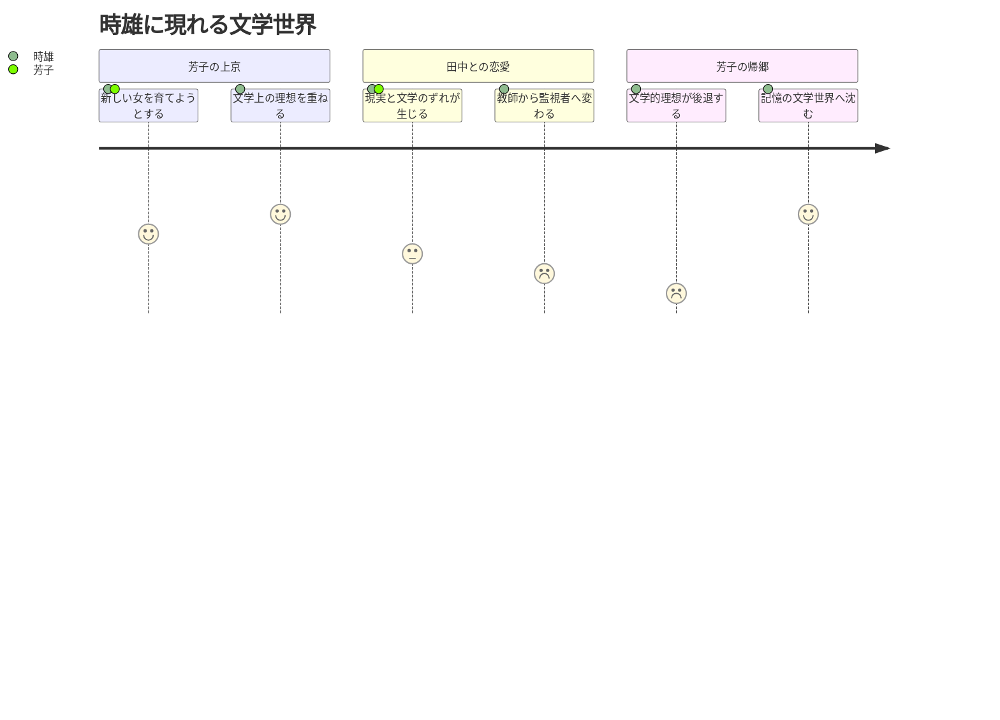
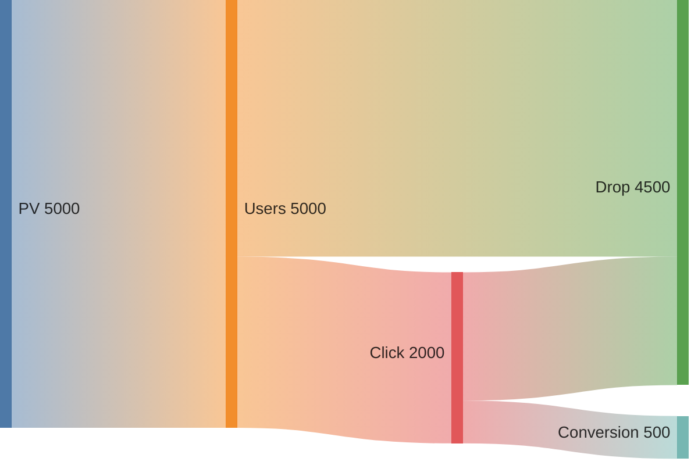

- fly.io を 同期に使う
- カラマーゾフの兄弟の疑問
	- カテリーナの裏切？彼女に何が起こったのか？
- ナウシカ批評に参戦
	- 危機の時代に読み解く『風の谷のナウシカ』
	- 『ナウシカ考』
- 虚無について
	- ナウシカ
	- 異邦人
	- イワン
	- 悪霊
	- マルホランドドライブ
- 「蒲団」
- 映画批評
	- マルホランド
	- ツインピークス
- 未だに Googleを無料で使っている
- 事務所の椅子 kevy, アリンコ、セブン
- 眺めの良いカフェ
- 今月の選曲
- コテンラジオ ≫ 深井龍之介はスゴイ
- 民主主義について [ChatGPTとの議論](https://chatgpt.com/share/6a5a9f28-7ccc-83ee-ad0e-700118b272ec)
- アマプラでエッチそうなので観たら良かった映画
	- 白雪姫／ルー・ドゥ・ラージュ
	- 華麗な関係／シルヴィア・クリステル
	- O嬢の物語／コリンヌ・クレリー
	- スチューデント／ソフィー・マルソー
	- 女性上位時代／カトリーヌ・スパーク
	- 美しき諍い女／エマニュエル・ベアール
	- 発禁本 SADE／イジルド・ル・ベスコ
- 映画評を「たまゆらの女」のように男女の会話で説明する
	- 男の属性：独身、30歳前後、遠距離恋愛経験あり、建築家
	- 女の属性：独身、30歳前後、遠距離恋愛経験あり、フランス料理店で働いている。

### Mermaid の練習

