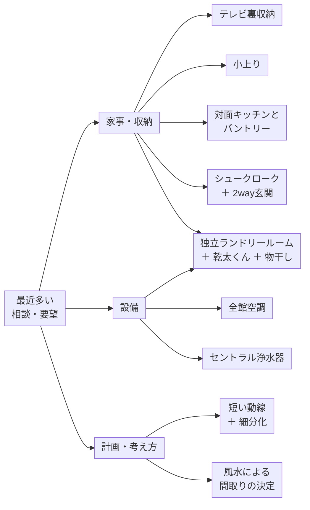
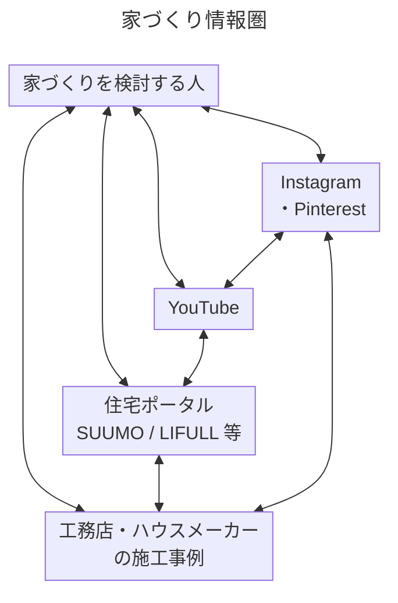

私は建築設計事務所を運営しており、個人の方の注文住宅の設計・監理業務が多い。住宅の相談や設計を進める際に頂く要望の中に、この3年ほどの間に特に増えたものがある。それらについてこの機会に考察・分析し、まとめておきたい。

### この議論のきっかけ
それらの相談・要望は、単独で見れば施主個別の都合によるものに見える。不思議に思ったのは、施主ごとの都合に思えたその相談・要望は、当然複数あるわけだが、それらの組み合わせも含めて驚くほど似通っていることだ。

まとめると、下図の相談・要望に絞られ、これらの複数の組み合わせになることが多い。

「テレビ裏収納」はテレビ廻りだけ見れば合理的なので、施主が自身の現実的な課題解決のために、考え抜いてたどり着いた要望に見える。

実際、私がテレビ裏収納を採用した改装計画ではリビングの斜めの壁をどのように扱うかが課題だった。「テレビ裏にリビングの細々したものを仕舞うことはできますか？」という要望が出たときに、ソファー、テレビ、リビング収納、動線の整理が一気に解決することに気が付き、この案に飛び付いたのは、むしろ設計者の私の方であった。

「小上り」は、私の事務所に3畳のタタミ小上りがあり、事務所の作品でも小上りがある家が多いので、それを取り入れたい施主が多いのかなぁ、と思っていた。しかし一方で「小上り」は思っている以上に空間にゆとりがなければ、邪魔なただの段差になりやすいことにも気が付いていた。

さらに、キッチンから洗濯機置き場の「短い動線」や全館空調の要望になると、どちらも専門的な建築計画や設備設計の領域に入ってくる。特に「回遊動線」や第一種換気を含む設備計画は、本来であれば計画規模や建物全体との関係を考えながら、設計者側から施主へ提案する類のものである。

「テレビ裏収納」と「小上り」、そして「短い動線」への相談・要望が 3件くらい続いたとき、あまりに同じような要望が重なり過ぎることに気が付いた。

そこで調べてみると、どうやら単なる偶然の一致ではなく、ネット上で繰り返し提示されている定型句や定型化された間取りが、そのまま設計への要望となって現れているようなのである。

上図は施主が家づくりを始めるときにネット上で情報を得る場所と、その情報が循環する様子を単純化したものである。

Instagram や Pinterest、YouTube、住宅ポータル、工務店やハウスメーカーの施工事例などが相互に参照され、一つの情報圏を形成しているように見える。

ここではこの情報を得る場所とその流れを「**家づくり情報圏**」と名付ける。

この「家づくり情報圏」には、「便利アイデア」や「家事ラク」の情報が数多く集積されている。一つ一つのアイデアは写真や短い動画で説明しやすく、視覚的にも理解しやすい。一方、そのアイデアを採用することで失われる面積や、建物全体との関係は、同じようには伝わりにくい。

例えばトイレひとつを計画するにしても、予算、法規、立地環境、敷地、外壁ラインと開口部、通風・採光、高さなどが絡み合る。単純に一つの機能を追加するだけの問題ではなく、建物全体のプランニングに影響する。

ある便利な機能を持った部屋を追加するということは、そのための床面積を必要とする。同じ延床面積の中で計画するのであれば、当然その分だけ他の空間は小さくなる。既存の空間を維持しようとすれば床面積が増え、建築費にも影響する。

さらに、住宅設計において有限なのは床面積や予算だけではない。外壁に面する場所、窓を設けられる場所、採光や通風、家具を置ける壁面、設備スペースなども有限の資源である。

便利な機能の追加について考えるときには、立地環境、外壁ライン、開口部の位置、通風・採光などについても、同じ住宅を構成する条件として検討する必要がある。

相談・要望は、先ほどの図で大きく3つに分類した。これらの概略を述べる。

### 家事・収納
「テレビ裏収納」「小上り」「シュークローク」「独立ランドリールーム」などは、それぞれ専用の床面積を必要とする。

仮に住宅の建築費を坪150万円程度とすれば、1畳はおおむね75万円程度の床面積に相当する。もちろん実際の建築費の増減が床面積に単純比例するわけではないが、床面積を無料のものとして考えることはできない。

また、建ぺい率や容積率などによって建築可能な面積には上限がある。特に都市部の狭小敷地では、単純な工事費とは別に、限られた床面積を何に配分するのかという問題が大きくなる。

これらの要望は、リビングの片づけ、リビングに異なる性格の特別な空間を挿入する、玄関土間を片付ける、あるいは「洗う→干す→しまう」を一か所で完結させる、といったライフハックとして SNSで伝えやすい。

つまり、何かを「つくる設計」はSNSに載せやすく、「つくらない設計」はSNSに載せにくい。

小上りをつくったことは一枚の写真で伝えられる。しかし、小上りをつくらず、その分リビングを広くしたことの価値は、一枚の写真からは分かりにくい。

また、ここでは機能を固定することによって得られる利便性が強調される一方、多用途の空間としてさまざまな使い方を受け入れることや、将来的な使われ方の変化といった価値は相対的に見えにくい。

### 設備
「全館空調」「セントラル浄水器」はこれまでの相談・要望とは少し性格が異なる。

「全館空調」は高気密・高断熱、UA値・C値、第一種換気、全館空調などが一連の「高性能住宅」という情報群の中で語られることが多い。

「絶対に失敗しない～」「高級ハウスメーカーでは標準の～」といった表現とともに紹介され、この情報圏では、全館空調が単なるオプション設備ではなく、「ちゃんと勉強して家を建てる人が選ぶもの」といった意味まで帯びているように見える。

「セントラル浄水器」は流行というよりメーカー発のコンテンツマーケティングが住宅情報圏に入り込んできたものに見える。

こうした情報では、高機能・高性能であることのメリットは理解しやすい。一方、その設備がその住宅に本当に必要なのか、設置費用や更新費用、設備スペースなどを含めて他の方法と比較する議論は、相対的に目立ちにくい。

### 計画・考え方
「短い動線＋細分化」については、まず「動線は短いほどよい」という価値観がある。

一方で、「洗面と脱衣を分ける」「家族用玄関と来客用玄関を分ける」「洗濯のための専用室をつくる」というように、住宅の機能を細かく切り分けることも推奨される。

「短い動線」と「機能ごとの細分化」という二つの価値観を同時に満たそうとすると、小さな部屋を数多くつくり、それぞれを複数の扉でつなぐという平面が生まれやすい。

「風水」は、「運気の下がる間取り」「鬼門を避けた方が良い部屋」などのワードが、家づくりを検討している人々の潜在的不安を刺激し、間取りを決定する際の新たな判断基準を与えているように見える。

ここでも、「動線は短いほどよい」という前提そのものを問い直したり、移動する距離や時間が場所の性格や気持ちを切り替える働きを考えたりする議論は、相対的に少ないように思う。

また、細分化することで床面積だけでなく、窓、壁面、出入口などの有限な資源がどのように配分されるのかという議論も必要だろう。

風水についても、その歴史的背景や、現代の住宅計画に照らした合理性を改めて検証する余地がある。

### 私の仮説
少なくとも私はこれまで、住宅設計では **「限られた面積をどう空間として豊かにするか」** が重要な課題だと考えてきた。ところが現在の「家づくり情報圏」、とりわけ SNS では、**「暮らしの一つ一つの行為に専用の場所を与える」** 方向へ向かっているようである。これは言ってみれば、

**「部屋」ではなく「家事タスク」を単位として平面を作る思想**

である。しかも Instagram では一つ一つが「便利アイデア」として切り離されて流れる。仮に施主が20個の便利アイデアを保存して設計者のところへ持ってきたとしても、その20個を同時に成立させるためにどれだけの床面積が必要なのか、という情報は一つ一つの投稿には表示されない。又、SNSでは「つくったメリット」は見えるが、「そのために失ったもの」は見えにくい。

おそらく今、設計者が相手にしているのは単なる「施主要望」ではなく、

**Instagram や YouTube のアルゴリズムが編集した住宅プログラム**

なのだと言えないだろうか？

そして、こうしたアルゴリズムを介して繰り返される相談・要望は、それぞれ個別の課題に対する局所的な解決策である。テレビ裏収納はテレビ廻りを解決し、ランドリールームは洗濯を解決し、2way玄関は玄関廻りを解決する。しかし、それぞれの局所最適解を足し合わせた結果、住宅全体が最適になるとは限らない。

### 概論まとめ
私は、一時期お茶を習っていた。そこで得た一番大きな建築的な気づきは、寸法が大事であるということであった。どんなに良い茶碗、大好きな軸、素晴らしい生花であっても、スケールが合わなければ、それはそれは惨めに感じるのである。お茶の世界では、さまざまなバランスが求められる。例えば私は建築家なので、お茶の世界でもスケールについては繊細な行き届いた組み合わせができるかもしれないが、それ以外のことについては詳しくない。どんなに道具の格式・由来・作家・年代・物語性が個別では素晴らしかったとしても、その場コンテクストに合っていなければ、やはり酷い組み合わせに感じさせることだろう。

これは住宅にも似ている。「よいもの」を集めることと、「よい全体」をつくることは違う。つまり、

**「良い要望」の足し算が、「良い住宅」になるとは限らない。**

施主要望を実現することは設計の重要な仕事である。しかし要望をそのまま並べることと、要望を設計することは違う。個々の要望が住宅全体の中でどの程度の面積と費用を使い、何を得て何を失うのかを検討し、優先順位をつけることも設計者の仕事である。

[[家づくりの相談で最近多いこと 01 家事・収納|次のノート]]では、先に示した「家事・収納」について分析する。

### シリーズ仮題
- [[家づくりの相談で最近多いこと 01 家事・収納]]：「家事ラク」のジャンル化
- 家づくりの相談で最近多いこと 02 設備：家づくりの勉強し過ぎ？
- 家づくりの相談で最近多いこと 03 計画：これは物流倉庫のダイアグラムだ！
