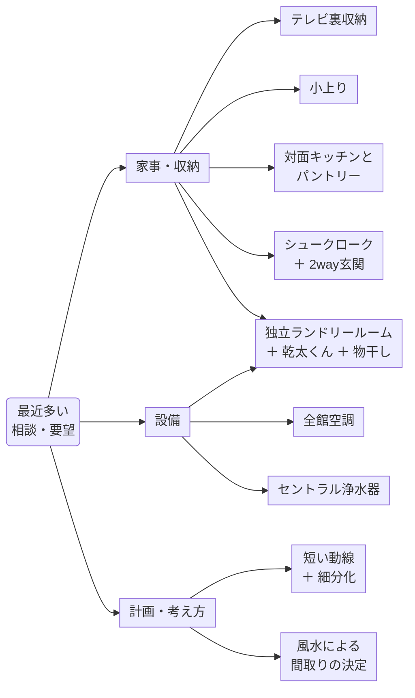
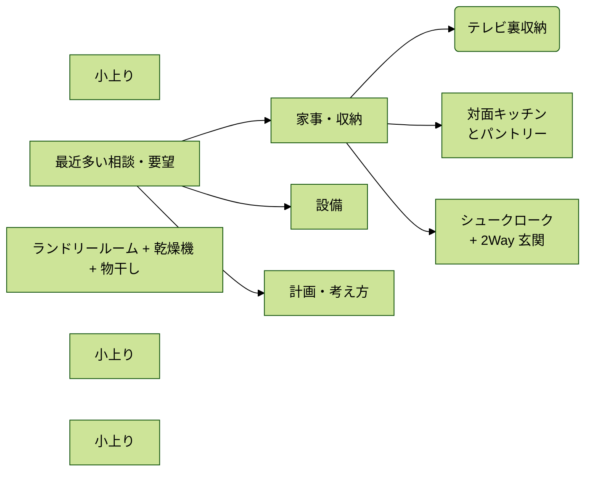

```mermaid
---
config:
    flowchart:
        padding: 6
---
flowchart LR
    A("最近多い<br>相談・要望")

    A --> B["家事・収納"]
    A --> C["設備"]
    A --> D["計画・考え方"]

    B --> B1["テレビ裏収納"]
    B --> B2["小上り"]
    B --> B3["対面キッチンと<br>パントリー"]
    B --> B4["シュークローク<br>＋ 2way玄関"]
    B --> C1["独立ランドリールーム<br>＋ 乾太くん ＋ 物干し"]

    C --> C1
    C --> C2["全館空調"]
    C --> C3["セントラル浄水器"]

    D --> D1["短い動線<br>＋ 細分化"]
    D --> D2["風水による<br>間取りの決定"]
```

```mermaid
%%{init: {"theme":"forest"}}%%
flowchart LR
    A("テレビ裏収納")
    B["小上り"]
    C["対面キッチン<br/>とパントリー"]
    D["シュークローク<br/> + 2Way 玄関"]
    E["家事・収納"]
    F["最近多い相談・要望"]
    G["設備"]
    H["計画・考え方"]
    I["ランドリールーム + 乾燥機 + 物干し"]
    J["小上り"]
    K["小上り"]
    E --> A
    E --> C
    E --> D
    F --> E
    F --> G
    F --> H
    %% mermaid-flow:pos A=484,145 B=472,558 C=497,217 D=498,302 E=238,258 F=69,372,97,33 G=245,374 H=233,497 I=499,391 J=495,448 K=568,515
```

テスト